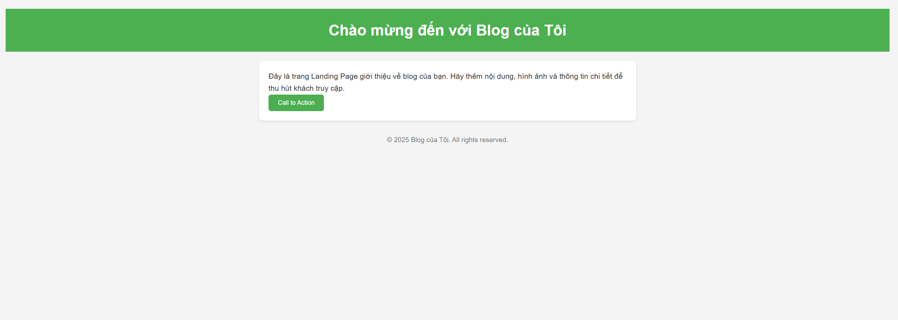

# 🚀 Giới Thiệu Django Blog  

**Django Blog** là một nền tảng chia sẻ thông tin, kiến thức và kinh nghiệm qua các bài viết. Dự án này cung cấp giải pháp quản lý nội dung hiệu quả, giúp người dùng dễ dàng đăng tải, chỉnh sửa và tương tác với bài viết.  

  

---

## 🎯 Mục Đích  

### 📚 Chia Sẻ Kiến Thức  
Django Blog là nơi bạn có thể chia sẻ hiểu biết, kinh nghiệm và thông tin hữu ích với cộng đồng. Từ bài viết hướng dẫn kỹ thuật đến chia sẻ cảm hứng, nền tảng này giúp lan tỏa tri thức một cách dễ dàng.  

### 🤝 Tương Tác & Giao Lưu  
Người dùng có thể **bình luận, thích bài viết** và trao đổi ý kiến với nhau, tạo nên một cộng đồng năng động.  

### 🎨 Giao Diện Thân Thiện  
Blog được thiết kế với giao diện hiện đại, dễ sử dụng, cho phép người dùng điều hướng và tìm kiếm bài viết một cách nhanh chóng.  

 