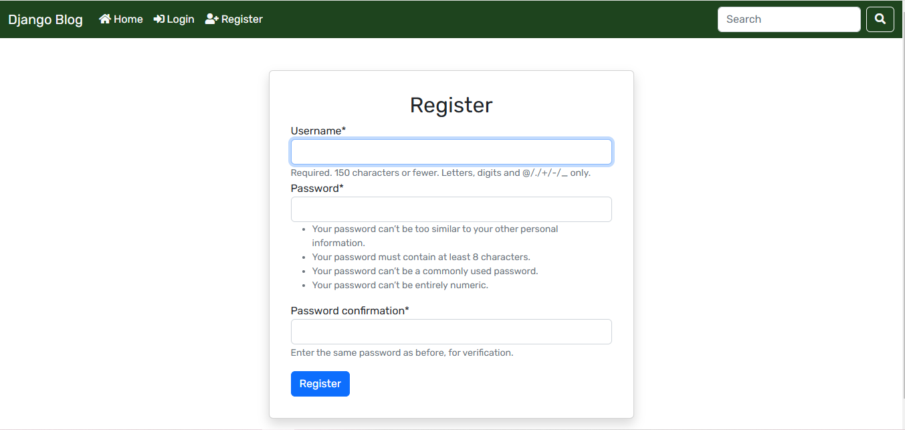
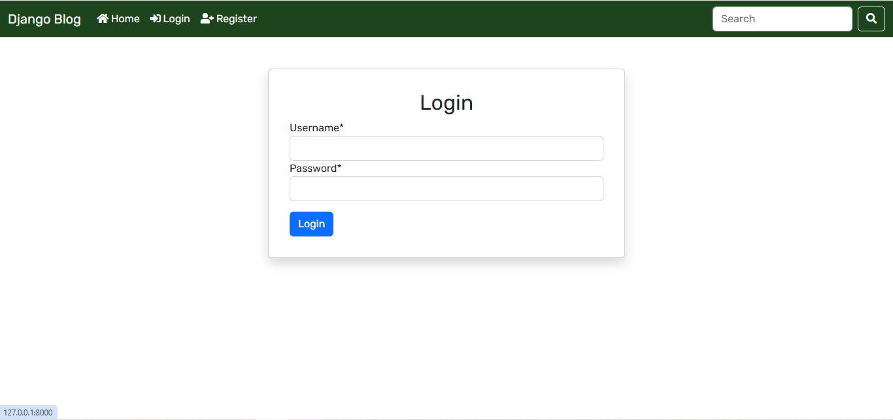
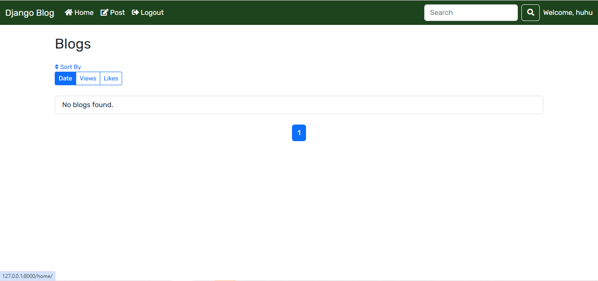
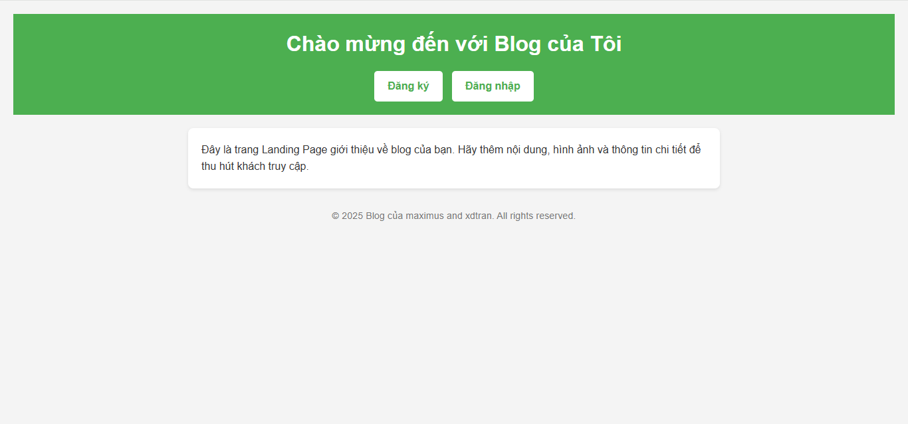

# 🚀 Django Blog  

**Django Blog** là một nền tảng chia sẻ kiến thức, kinh nghiệm và thông tin qua các bài viết. Phiên bản mới đã được nâng cấp với các tính năng quản lý tài khoản, giúp người dùng tương tác dễ dàng hơn.  

## 🌟 Tính Năng Mới  

### 🔑 Xác Thực Người Dùng  
- 🆕 **Đăng Ký Tài Khoản**: Tạo tài khoản mới bằng email và mật khẩu.  
- 🔐 **Đăng Nhập / Đăng Xuất**: Quản lý truy cập an toàn.  
- ⚙️ **Trang Quản Lý Tài Khoản**: Cập nhật thông tin cá nhân.  

  
  

---

## 🖊️ Tính Năng Của Blog  

- 📌 **Đăng Bài Viết**: Người dùng đăng nhập có thể tạo bài viết mới.  
- ✏️ **Chỉnh Sửa & 🗑️ Xóa Bài Viết**: Quản lý bài viết dễ dàng.  
- 💬 **Bình Luận & ❤️ Like**: Tương tác với bài viết của người khác.  

  

---

## 🏠 Giao Diện Trang Chủ  

  

---

🚀 **Bắt đầu ngay!** Hãy đăng ký tài khoản và trải nghiệm nền tảng Django Blog ngay hôm nay! 🎉