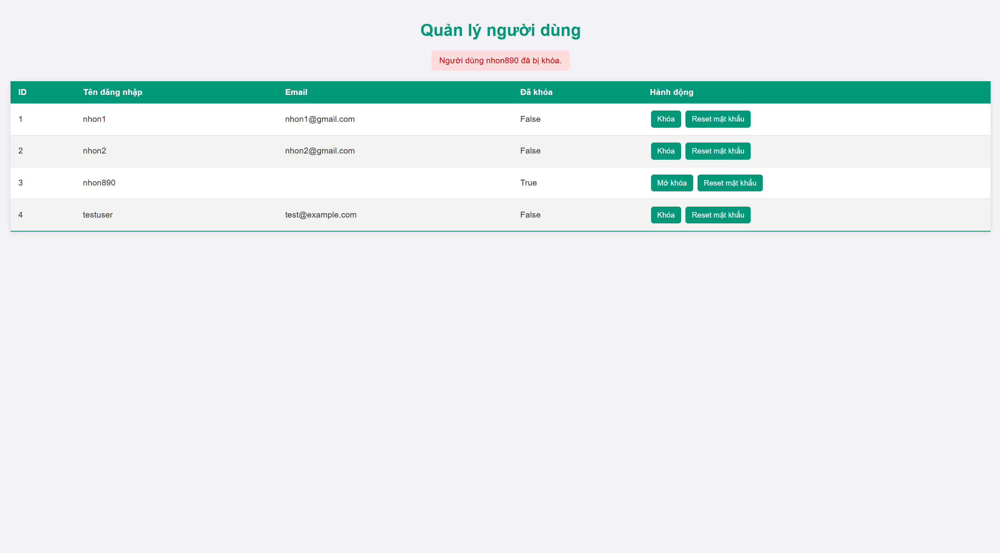
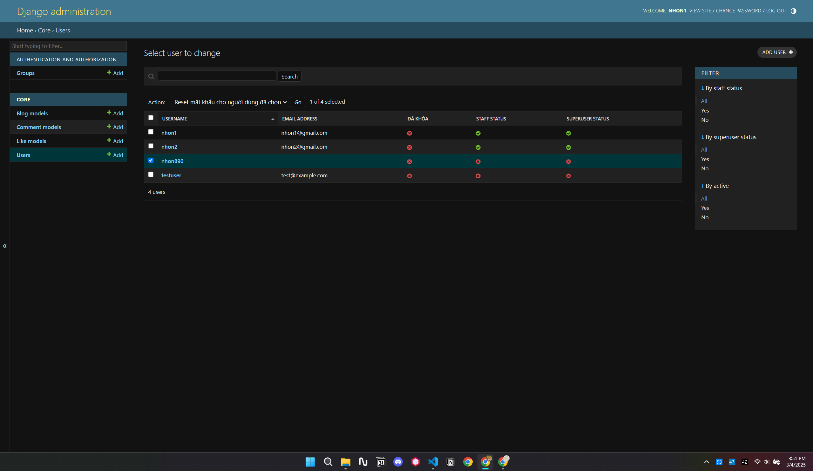

# 🚀 Django Blog - Quản Lý Người Dùng

**Django Blog** là nền tảng blog được xây dựng trên Django, cho phép người dùng đăng bài, bình luận và tương tác. Phiên bản này đã được cập nhật với tính năng quản lý người dùng dành cho admin.

## 🌟 Tính Năng Mới

### 👤 Quản Lý Người Dùng (Admin)
- **Trang quản lý người dùng:** Admin có thể truy cập trang quản lý để xem danh sách người dùng.
- **Khóa người dùng:** Admin có quyền khóa tài khoản của người dùng. Khi tài khoản bị khóa, người dùng sẽ không thể đăng nhập và website sẽ hiển thị thông báo **"Tài khoản của bạn đã bị khóa"**.

| Ảnh minh họa | Ảnh minh họa |
| --- | --- |
|  |  |

| Ảnh minh họa |
| --- |
|  |

- **Reset mật khẩu:** Admin có thể đặt lại mật khẩu cho người dùng khi cần thiết.

| Ảnh minh họa |
| --- |
|  |

### 🔐 Quản Lý Tài Khoản Cho Người Dùng
- **Đăng ký tài khoản:** Người dùng có thể tạo tài khoản mới bằng email và mật khẩu.
- **Đăng nhập / Đăng xuất:** Quản lý phiên đăng nhập một cách an toàn.
- **Cập nhật thông tin cá nhân:** Người dùng có thể chỉnh sửa thông tin cá nhân của mình.

---

## 📌 Lưu Ý

- Khi tài khoản người dùng bị khóa, hệ thống sẽ hiển thị thông báo **"Tài khoản của bạn đã bị khóa"** và ngăn người dùng truy cập vào tài khoản của mình.
- Tính năng quản lý người dùng giúp admin kiểm soát và đảm bảo an toàn cho toàn bộ hệ thống.
