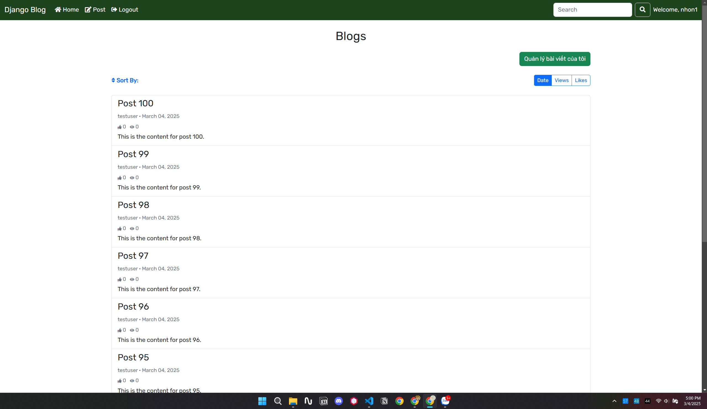
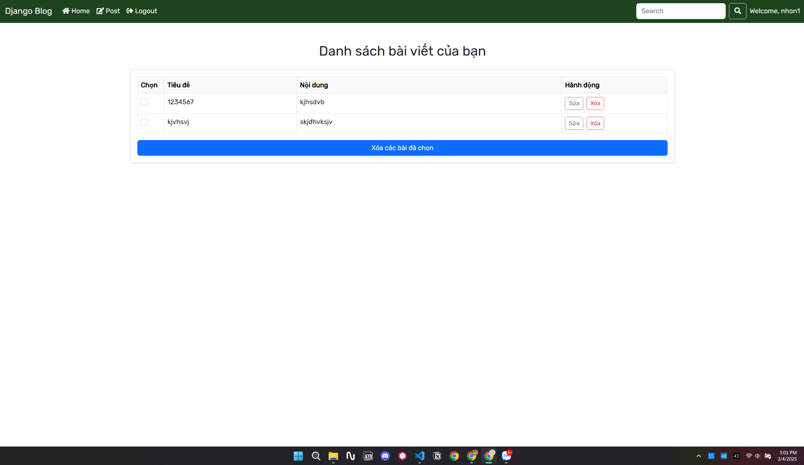
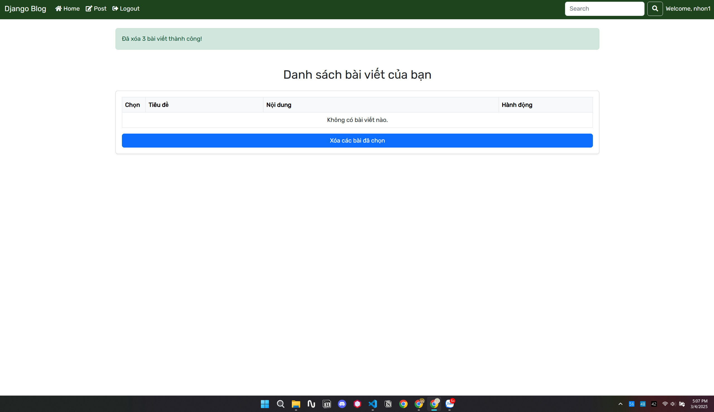

# 🚀 Django Blog - Quản Lý Người Dùng & Bài Viết  

**Django Blog** là nền tảng blog được xây dựng trên Django, cho phép người dùng đăng bài, bình luận và tương tác. Phiên bản này đã được cập nhật với tính năng **quản lý bài viết cá nhân**, giúp người dùng kiểm soát nội dung của mình dễ dàng hơn.

## 🌟 Tính Năng Mới  

### ✍️ Quản Lý Bài Viết Cá Nhân  
- **Xem danh sách bài viết:** Người dùng có thể truy cập trang quản lý bài viết của riêng mình.  

| Ảnh minh họa |
| --- |
|  |

- **Xóa nhiều bài viết cùng lúc:** Người dùng có thể chọn nhiều bài viết và xóa chỉ với một thao tác.

| Ảnh minh họa | Ảnh minh họa |
| --- | --- |
|  |  |

- **Cải thiện giao diện quản lý bài viết:** Giao diện trực quan hơn, giúp người dùng dễ dàng thao tác.  

---

## 📌 Lưu Ý  

- Người dùng có thể xóa nhiều bài viết cùng lúc nhưng sẽ không thể khôi phục lại sau khi đã xóa.  
- Tính năng quản lý bài viết giúp người dùng dễ dàng kiểm soát nội dung và giữ cho trang blog luôn gọn gàng.  
