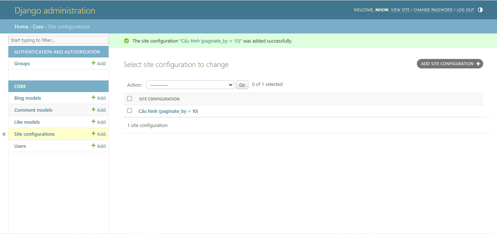
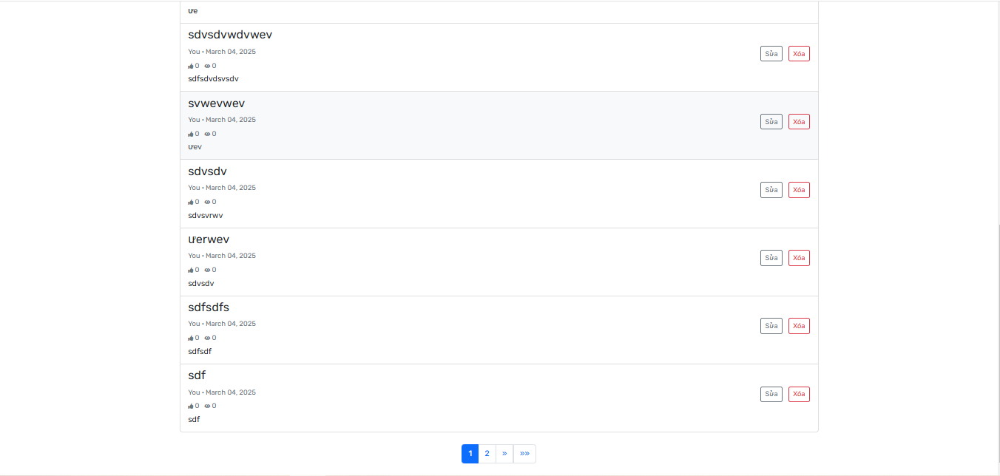

# 🚀 Django Blog - Quản Lý Người Dùng & Bài Viết  

**Django Blog** là nền tảng blog được xây dựng trên Django, cho phép người dùng đăng bài, bình luậu và tương tác. Phiên bản này đã được cập nhật với tính năng **quản lý bài viết cá nhân** và **giả lập chức năng phân trang** bằng cách thêm nhiều dữ liệu.

## 🌟 Tính Năng Mới  

### 📝 Giả Lập Chức Năng Phân Trang (Pagination)  
- **Phân trang mặc định:** Mỗi trang hiển thị **10 bài viết**, giúp cải thiện hiển thị danh sách bài viết của người dùng.  

| Ảnh minh họa | Ảnh minh họa |
| --- | --- |
|  |  |

- **Cải thiện giao diện quản lý bài viết:** Giao diện trực quan hơn, giúp người dùng dễ dàng thao tác.  

